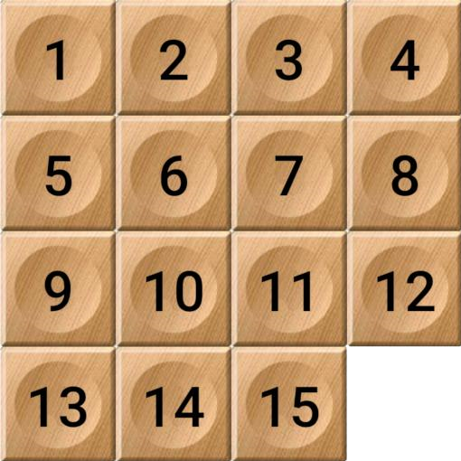

# Barley-break

1. **Read the guideline before start**

    - [Guideline](https://github.com/mate-academy/js_task-DOM-guideline)

2. **Result**

   Replace `<your_account>` with your Github username in the links

    - [DEMO LINK](https://andreas-just.github.io/js_barley-break/)
    - [PULL REQUEST](https://github.com/Andreas-Just/js_barley-break/pull/1)

___
## Task

**Implement** [15 Game](https://en.wikipedia.org/wiki/15_puzzle)

**Main goal:**

- by default game is in ‘won’ stage
- when user clicks ‘shuffle’ board is rearranged randomly
- user can move empty cell by using arrows Right, Left, Up, Down. NOTE: Right arrow moves empty cell to the left
- when user gets into ‘won’ stage, js alert ‘You won’ is shown.
- use js object to store state of the game. Based on the state - render the board.

**Stretch goal:**

- support swipes on mobile devices

___
### Screenshot of the game

